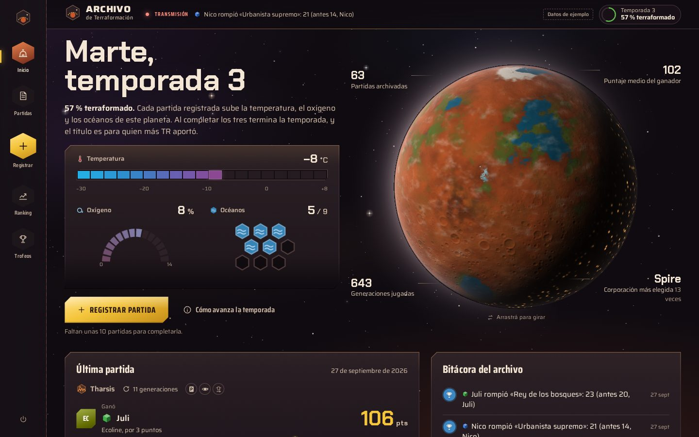
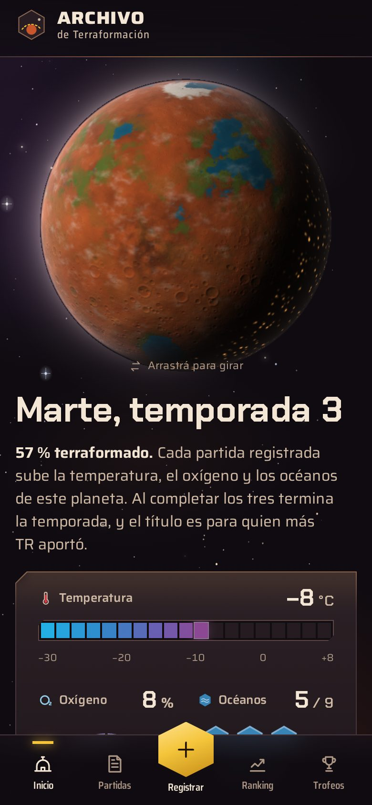

# Rediseño: Archivo de Terraformación

Propuesta completa de rediseño del frontend de TM Scorekeeper, con prototipo navegable, sistema de diseño, métricas nuevas y plan de implementación. Es un mockup: **no toca el código de `frontend/`**. Antes de implementar hay que aprobarlo (regla 1 de `.claude/CLAUDE.md`).

- **Prototipo:** `docs/redesign/mockup/`. Se abre con `npx serve docs/redesign/mockup` (o cualquier servidor estático) y funciona en escritorio y en el teléfono. El botón **Pantallas** abre el índice de todas las pantallas y estados, y permite ver la versión móvil dentro de un marco de teléfono.
- **Revisión técnica y optimizaciones:** [`REVIEW.md`](REVIEW.md).
- **Capturas:** carpeta [`screens/`](screens/).

| Escritorio | Móvil |
|---|---|
|  |  |

## 1. Concepto

La app deja de ser un formulario con tablas y pasa a ser la **consola del Comité de Terraformación del grupo**: un archivo en órbita alrededor de Marte. Tres ideas sostienen todo:

1. **Un solo planeta, siempre presente.** Un Marte en WebGL vive detrás de la interfaz y viaja entre pantallas. En el login es un horizonte árido; en el inicio muestra la terraformación de la temporada del grupo (océanos, vegetación, nubes, luces de ciudades); en cada partida gira hasta la región real del mapa (Tharsis, Hellas, Elysium, Utopia, Cimmeria, Vastitas Borealis, Amazonis) y proyecta la grilla de 61 hexágonos del tablero. Se puede girar arrastrando.
2. **El vocabulario del tablero, no el de un dashboard.** Termómetro de −30 a +8 °C en pasos de 2°, arco de oxígeno de 14 %, 9 casillas de océano, la pista de TR con casilleros naranjas y cada quinto amarillo, cubos de jugador en lugar de avatares, M€ amarillos, colores de marco de las cartas (verde automática, azul activa, rojo evento).
3. **Momentos de juego.** Registrar una partida termina en una ceremonia: suma por categoría con reordenamiento en vivo, ganador con lluvia de cubos, ELO, récords que se dan vuelta y medallas que caen. Es la única animación larga; el resto del movimiento es ambiental o responde a una acción.

Lo que se evitó a propósito: tarjetas redondeadas idénticas, gradientes violetas, emojis como íconos, tipografías de plantilla (Inter, Orbitron), y "tiles" de números grandes como único recurso.

## 2. Sistema de diseño

Todo está en `mockup/css/tokens.css`. Es un tema oscuro único y deliberado (Marte de noche desde la órbita).

### Color

| Rol | Token | Valor | Uso |
|---|---|---|---|
| Espacio | `--space` | `#0f0b10` | Fondo |
| Casco | `--hull-0..3` | `#171117` a `#33262c` | Placas, inputs, hover |
| Tinta | `--ink`, `--ink-2`, `--ink-3` | `#f4e6d4`, `#cdb8a4`, `#a99382` | Texto (todas ≥ 4.9:1 sobre cualquier casco) |
| Regolito | `--mars` | `#c8552b` | Marca, selección de navegación |
| MegaCréditos | `--mc` | `#f4c43a` | Acción principal, ganador, récord |
| Termómetro | `--temp-0..5` | `#23ade3` a `#de3446` | Muestreado del tablero (cian a carmesí) |
| Oxígeno, océano | `--oxygen`, `--ocean` | `#92cae7`, `#3682b4` | Parámetros globales |
| Pista de TR | `--track`, `--track-5` | `#e87c27`, `#f0d240` | Casilleros de la pista |
| Marcos de carta | `--frame-green/blue/red` | `#2f8a43`, `#3d85c2`, `#cc4340` | Logros, récords, eventos |

**Categorías de puntaje** (orden validado con el script de daltonismo del skill de dataviz: peor par adyacente ΔE 14.4 en protanopía, 17.0 en visión normal, todas ≥ 3:1 sobre `--hull-1`):

TR `#d95926` · Recompensas `#c95fb8` · Hitos `#c98500` · Recursos de cartas `#16a39b` · Cartas `#3f82e8` · Vegetación `#4c9a2f` · Ciudades `#9283e6` · Turmoil `#e45f5f`

**Jugadores:** cada uno tiene un color de cubo propio (rojo, verde, azul, amarillo, negro como en la caja, más naranja, violeta, rosa y blanco). El color nunca identifica solo: siempre va con el nombre. En el gráfico de ELO se resalta a quien elijas y el resto queda en gris, con etiquetas directas.

**Estados:** subida `--up` y bajada `--down`, siempre con ▲ ▼ y signo.

### Tipografía

| Rol | Familia | Por qué |
|---|---|---|
| Títulos y números | **Chakra Petch** 600–700 | Esquinas cortadas y contadores cuadrados, lo más cercano en Google Fonts a *Prototype*, la letra de los números y títulos del juego |
| Interfaz | **Saira** variable (ancho 62–125) | Una sola familia que se condensa para etiquetas y títulos de carta y se expande para la marca |
| Citas | **Crimson Pro** itálica | Las frases de color de los logros, como la itálica tipo Palatino de las cartas |

### Forma

- **Placas con chaflán** en lugar de radios: el tamaño del corte marca jerarquía (6, 12 y 22 px). Borde de bisel cálido arriba, sombra abajo, y un brillo que sigue al mouse sobre el metal.
- **Hexágonos** para lo que en el juego son losetas: navegación, medallas, semanas de actividad, pasos del asistente.
- **Cubos isométricos** para jugadores, en todas partes. En el perfil, un cubo 3D translúcido como las fichas reales, que gira y se inclina con el mouse.

### Movimiento

- Ambiente: estrellas con paralaje en tres capas, centelleo, alguna estrella fugaz, rotación lenta del planeta, nubes.
- Entrada de pantalla: las placas se despliegan desde su esquina en orden, una sola vez.
- Respuesta: botones con barrido de brillo, medallas y placas que se inclinan con reflejo, cubos que caen sobre la pista de TR.
- `prefers-reduced-motion` desactiva animaciones, paralaje, rotación e inclinación, y muestra la ceremonia ya resuelta.

### Navegación

Cinco destinos iguales en todos los tamaños: **Inicio, Partidas, Registrar, Ranking, Trofeos** (Récords y Logros). En escritorio es un riel izquierdo con hexágonos; en móvil, un dock inferior con el botón hexagonal dorado de Registrar en el centro. Jugadores pasa a ser parte de Ranking (clasificación + gestión), y los perfiles se abren desde cualquier nombre.

Los cortes de diseño se resuelven con **container queries** (`@container app`), no con media queries. Así el mismo código se ve en móvil dentro del marco de teléfono del prototipo, y en la app real permite paneles que se adaptan a su espacio.

## 3. Pantallas

| Pantalla | Qué cambia | Datos (API actual) |
|---|---|---|
| **Acceso** | Horizonte de Marte árido; mostrar/ocultar contraseña; error inline. | Requiere auth real (ver REVIEW S1). |
| **Inicio** | Planeta de la temporada con sus tres parámetros, lecturas en órbita (partidas, generaciones, puntaje medio del ganador, corporación más usada), última partida, bitácora de récords y logros, top 5 de ELO, carrera de la temporada. | `GET /games/`, `GET /elo/history`, `GET /records/`, logros por partida |
| **Partidas** | Filtros en una fila (mapa con su glifo, jugadores por cubo, tamaño de mesa); calendario de 52 semanas; cada partida es una "tira de misión" con los cubos ubicados sobre una pista de puntaje común, ganador, corporación y margen. Estado vacío diseñado. | `GET /games/` |
| **Informe de partida** | Planeta en la región del mapa con la grilla del tablero; pista de TR con los cubos; barras apiladas por categoría con vista de tabla; hitos y recompensas como en el tablero (con "robada"); ELO divergente; récords rotos y "cerca del récord"; logros desbloqueados. | `GET /games/{id}/results`, `/records`, `/elo`, logros |
| **Registrar partida** | **5 pasos en vez de 11**: partida (mapas visuales que giran el planeta), mesa (jugadores y corporaciones filtradas por expansión), hitos y recompensas (se tocan cubos; reglas de 3 máximo, empates y 2 jugadores aplicadas), planilla de puntaje con totales en vivo (tabla en escritorio, pestañas por jugador en móvil), revisión con desempate por M€. Borrador automático. | `POST /games/` |
| **Ceremonia** | Secuencia única al guardar: suma por categoría, reordenamiento, ganador con lluvia de cubos, ELO, récords, logros. "Saltar animación" siempre visible. | Respuesta de `POST /games/` (ver REVIEW S5) |
| **Ranking** | Clasificación con forma reciente y tendencia; gráfico de ELO con énfasis y rangos (todo, temporada, año, 3 meses); cara a cara; rivalidades; gestión de jugadores con color de cubo. | `GET /players/`, `GET /elo/history` |
| **Perfil** | Cubo 3D, arquetipo, ELO con rango y pico, seis lecturas, corporación favorita; pestañas Resumen, Partidas, Récords, Logros. Resumen con ELO, ADN de puntaje, rivales, rendimiento por mapa y por corporación. | `GET /players/{id}/profile`, `/elo-summary`, `/achievements`, `GET /elo/history` |
| **Récords** | Monumento para el récord máximo con su historia; placas con banda azul (cartas activas) y gráfico escalonado de cómo cambió de dueño; récords propuestos aparte. | `GET /records/` + historial (nuevo) |
| **Logros** | Medallas hexagonales cuyo material sube con el nivel: acero, titanio, oro M€, plasma, Gaia. Vista "progreso de" por jugador; ficha con la escalera de niveles, quién está en cada uno y desde cuándo. | `GET /achievements/catalog`, `GET /players/{id}/achievements` |
| **Estados** | Carga (radar + esqueleto), error de conexión con causa probable (servidor dormido en Render) y reintento, vacíos con acción. | — |

## 4. Funciones nuevas

Todas salen de datos que el backend **ya guarda**; ninguna requiere cargar nada nuevo al registrar una partida.

### Temporadas: el Marte del grupo
El grupo terraforma un planeta propio. Cada partida suma 0,8 pasos de temperatura, 1 % de oxígeno cada 52 puntos de vegetación del grupo y 0,375 océanos. Cuando los tres parámetros llegan al máximo, la temporada termina y gana quien más TR aportó por encima de 20. Con el historial de ejemplo, una temporada dura unas 24 partidas. *Calibración a decidir.*

### Métricas
- **Cara a cara:** porcentaje de partidas compartidas en que cada jugador terminó delante de otro. Rivalidades con más partidas.
- **Némesis y víctima favorita** de cada jugador (mínimo 4 partidas juntos).
- **ADN de puntaje:** promedio por categoría y su peso, contra el promedio del grupo. Define el **arquetipo** (Urbanista, Jardinero de Marte, Coleccionista de proyectos, Bioingeniero, Cazador de hitos, Cazarrecompensas, Operador político, Terraformador puro).
- **Por mapa y por corporación:** partidas, victorias y porcentaje.
- **Forma reciente** (últimas 8 posiciones), **rachas** (mejor y actual), **posición media**, **puntos por generación**, hitos y recompensas por partida (`avg_milestones` y `avg_awards` ya existen en el perfil).
- **Cerca del récord:** en cada partida, quién quedó a 3 puntos o menos de un récord.
- **Historia de cada récord:** cada vez que cambió de dueño.
- **Calendario de actividad:** partidas por semana del último año.

### Récords propuestos
Aplanadora (mayor margen), Por un pelo (victoria más ajustada), Motor perfecto (puntos por generación), Blitz (victoria con menos generaciones), Cima del Consejo (ELO más alto), Imparable (racha más larga), Tesorería (más M€ al final).

### Logros propuestos
Coleccionista de corporaciones (5/10/20/30 distintas), Fotofinish (ganar por 2 o menos), Blitz (ganar en 9 generaciones o menos), Matagigantes (ganar con el n.º 1 del ranking en la mesa: 1/3/6), Mesa llena (ganar con 5 jugadores), Urbanista (10/15/20/25 puntos de ciudades).

### Pequeñas mejoras de uso
Color de cubo elegible por jugador, borrador automático del formulario, "Empezar en blanco", errores con foco y scroll, desempate explicado antes de guardar, "Saltar animación", vista de tabla en los gráficos.

## 5. Accesibilidad

- Contraste: tinta ≥ 4.9:1 en cualquier superficie; paleta de categorías validada para protanopía y deuteranopía.
- Identidad nunca solo por color: cubo + nombre, ▲▼ + signo, leyenda en todos los gráficos con dos o más series, etiquetas directas en el gráfico de ELO.
- Todo es operable con teclado: botones reales, foco visible, pestañas con flechas, diálogos con foco atrapado y Escape. Corrige los bloqueos actuales (REVIEW, prioridad 4).
- Objetivos táctiles ≥ 44 px en móvil.
- Tooltips solo amplían: cada gráfico tiene vista de tabla o los valores visibles.

## 6. Rendimiento

- El planeta se calcula una sola vez (superficie equirectangular de 2048×1024 en el escritorio, 1024×512 en teléfonos, en 12 franjas para no trabar la carga) y después cada cuadro solo hace iluminación. Se dibuja únicamente en el recuadro del planeta, baja a 30 cuadros cuando nada se mueve y se detiene con la pestaña oculta.
- Sin WebGL2, cada lugar del planeta muestra una esfera en CSS.
- Las estrellas se pintan una vez por tamaño de pantalla y se mueven con CSS.
- El prototipo pesa unos 370 kB de JS y CSS propios sin minificar (unos 94 kB con gzip). Usa Preact + htm (~15 kB) en lugar de React solo porque es un mockup sin paso de build; la implementación real sigue en React.

## 7. Plan de implementación

Se integra con lo que pide [`REVIEW.md`](REVIEW.md). Por fases, cada una con sus tests:

1. **Base (3 a 4 días).** `tokens.css` reemplaza `index.css`; componentes base como CSS Modules (`Plate`, `Button`, `Cube`, `CorpEmblem`, `MapGlyph`, `Medal`, `Tabs`, `Sheet` sobre `<dialog>`, `Stepper`); íconos SVG propios (sale `lucide-react`); layout route con riel y dock; container queries. *Verificación:* tests de componentes, navegación completa con teclado, Lighthouse a11y ≥ 95.
2. **Registrar partida y ceremonia (4 a 5 días).** `useReducer` + borrador en `sessionStorage`; planilla de puntaje; ceremonia leyendo la respuesta de `POST /games` (que debe incluir logros, REVIEW S5). *Verificación:* Playwright del flujo completo en 390 px y 1440 px, empates y partidas de 2 jugadores.
3. **Planeta (2 a 3 días).** `PlanetStage` como contexto + `PlanetSlot`; lazy-load del módulo WebGL; fallback CSS. *Verificación:* 60 fps en un teléfono de gama media, sin errores con WebGL deshabilitado.
4. **Pantallas de consulta (5 a 6 días).** Inicio, Partidas, Informe, Ranking, Perfil, Récords, Logros, con TanStack Query. Gráficos en SVG propio (sale `recharts`, ~107 kB gzip). *Verificación:* tests por pantalla con API mockeada, estados de carga, error y vacío.
5. **Métricas nuevas (backend, 3 a 4 días).** Endpoints o campos para cara a cara, ADN de puntaje, por mapa y corporación, historia de récords, temporadas, récords y logros propuestos. *Verificación:* tests unitarios de cada cálculo con empates.

## 8. Decisiones abiertas

1. **Nombre visible:** "Archivo de Terraformación" o mantener "TM Scorekeeper".
2. **Temporadas:** ¿se quieren? ¿con esta calibración (unas 24 partidas) o por fecha (por ejemplo, trimestres)?
3. **Colores de cubo:** ¿los elige cada jugador o se asignan fijos?
4. **Nombres de hitos y recompensas:** quedan en inglés como hoy; ¿traducirlos al español de la edición local?
5. **Récords y logros propuestos:** cuáles entran y con qué umbrales.
6. **Ceremonia:** ¿se abre siempre al guardar o con opción de saltarla por defecto?
7. **Hito "Spacecrafter"** de Vastitas Borealis: en la edición actual parece llamarse "Spacefarer". Cambiarlo requiere migración de enum (REVIEW).

## 9. Estructura del prototipo

```
mockup/
├── index.html
├── css/            tokens, base, shell (riel, dock, marco de teléfono), componentes, instrumentos, pantallas
└── js/
    ├── app.js      shell, router con #hash, estados de demo
    ├── data/       catálogo (enums del backend), generador de 63 partidas, derivaciones (ELO K=32, récords, logros, temporadas)
    ├── fx/         planeta WebGL (shaders + motor), estrellas, confeti
    ├── ui/         íconos, átomos, instrumentos (termómetro, oxígeno, océanos, pista de TR, barras, ELO, cara a cara), sheet, estados
    └── screens/    una por pantalla + índice del prototipo
```

Los datos son de ejemplo, generados con las mismas reglas que el backend: posiciones con desempate por M€, ELO por pares con K = 32, récords con desempate estricto y logros con los umbrales de `backend/services/achievement_evaluators/definitions.py`.
